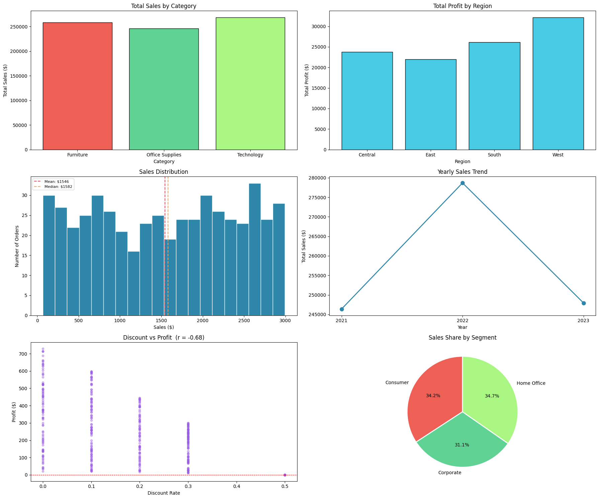

# 🛒 Superstore Sales Analysis
A simple data analysis project exploring sales trends, profit patterns, and the impact of discounts using Python.

## 📂 Dataset
The dataset is randomly generated. It contains 500 clean rows with no null values or duplicates, across columns like Category, Region, Sales, Discount, and Profit.

## 📘 Libraries Used
| Library | Use |
|---|---|
| `pandas` | Data loading & grouping |
| `numpy` | Numerical operations |
| `matplotlib` | Charts & visualizations |
| `statistics` | Mean, median, std deviation |

## 📊 Visualizations

##  ▶️ Run in Google Colab

